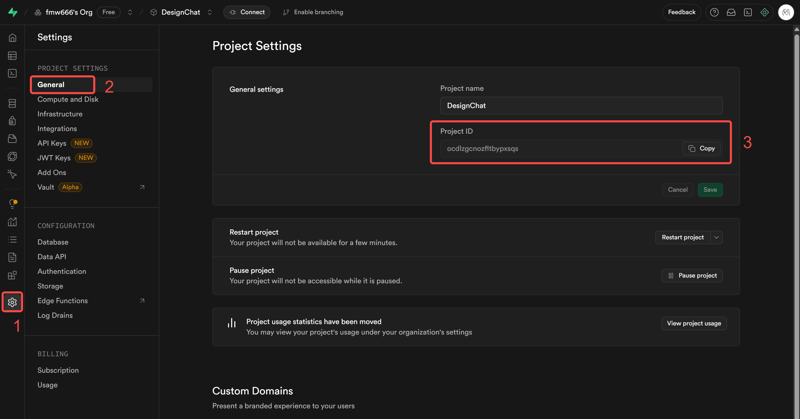

# Supabase Auth

## 说明

通过 email 进行认证，使用 OTP 登录，涉及两个邮件模板：signup 和 magic link，均建议配置为 `{{.Token}}` 验证码形式。

详情请参考：<https://supabase.com/docs/guides/auth/auth-email-passwordless#with-otp>

## 环境变量说明

- `VITE_SUPABASE_PROJECT_REF`：Supabase 项目唯一标识。
  - 获取方式：
    1. 登录 Supabase 控制台，进入你的项目。
    2. 网址中 `project/` 后的内容即为 Project Ref，例如 `https://supabase.com/dashboard/project/ocd...sqs/auth/templates`。
    3. 也可在 **Settings > API** 页面查看。

<div align="center"></div>

- `VITE_SUPABASE_ACCESS_TOKEN`：Supabase 个人访问令牌。
  - 获取方式：
    1. 登录 Supabase 控制台。
    2. 进入 [Account Tokens](https://supabase.com/dashboard/account/tokens) 页面，生成并复制 Access Token。

## 初始化

### 通过脚本自动化

推荐使用自动化脚本快速配置认证邮件模板和相关安全策略。

#### 依赖环境变量
- `VITE_SUPABASE_PROJECT_REF`
- `VITE_SUPABASE_ACCESS_TOKEN`

#### 操作步骤
1. 确保 `.env` 文件中已配置上述变量。
2. 运行以下命令自动初始化认证设置：
   ```bash
   npm run init:auth
   ```
   或使用 Docker：
   ```bash
   docker run --rm -v %cd%:/app -w /app node:20 npm run init:auth
   ```

#### 脚本作用
- 自动配置 signup、magic link 等邮件模板为 OTP 验证码模式。
- 应用推荐的认证安全设置。
- 可根据需要自定义邮件模板内容。

### 手动配置

如需手动配置邮件模板和认证设置：

1. 登录 Supabase 控制台，进入你的项目。
2. 进入 **Auth > Templates** 页面，分别编辑 signup 和 magic link 模板，将内容设置为 `{{.Token}}`。
3. 可根据需要自定义邮件内容和样式。

<div></div>

---

## 常见问题/注意事项

- **Q: 脚本执行报错"missing required environment variables"？**
  - A: 请检查 `.env` 文件是否存在且变量名拼写正确。
- **Q: 邮件模板未生效？**
  - A: 检查 Project Ref 和 Access Token 是否正确，或尝试手动刷新模板。
- **Q: 如何自定义邮件内容？**
  - A: 可在 Supabase 控制台手动编辑模板，或修改脚本内容后再运行。

如有更多问题请查阅主项目文档或提交 issue。
