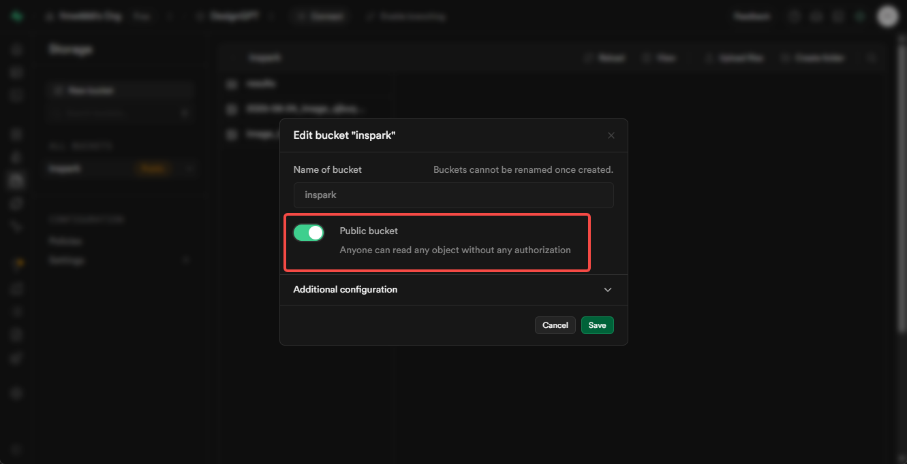
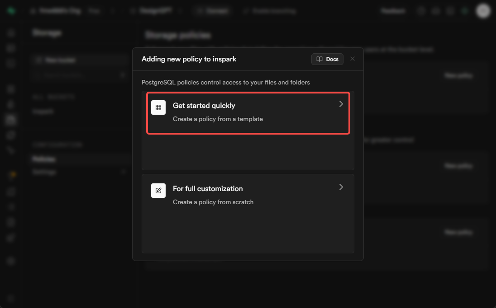
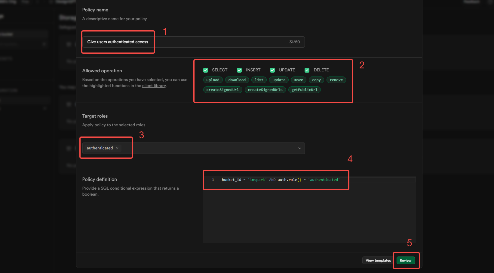

# Supabase Storage

## 环境变量说明

- `VITE_SUPABASE_URL`：Supabase 项目 URL。
  - 获取方式：Supabase 控制台 **Settings > API** 页面。
- `VITE_SUPABASE_SERVICE_ROLE_KEY`：Supabase 服务角色密钥（用于创建存储桶和设置策略）。
  - 获取方式：Supabase 控制台 **Settings > API** 页面，复制 service_role 密钥。
- `VITE_SUPABASE_POSTGRES_URL`：数据库连接字符串。
  - 获取方式：参考 db/README.md。

## 初始化

### 通过脚本自动化

推荐使用自动化脚本快速创建存储桶并设置安全策略。

#### 依赖环境变量
- `VITE_SUPABASE_URL`
- `VITE_SUPABASE_SERVICE_ROLE_KEY`
- `VITE_SUPABASE_POSTGRES_URL`

#### 操作步骤
1. 确保 `.env` 文件中已配置上述变量。
2. 运行以下命令自动初始化存储：
   ```bash
   npm run init:storage
   ```
   或使用 Docker：
   ```bash
   docker run --rm -v %cd%:/app -w /app node:20 npm run init:storage
   ```

#### 脚本作用
- 自动创建指定名称的存储桶（如 designchat）。
- 自动设置 Row Level Security (RLS) 策略，保障数据安全。
- 支持多种访问控制策略（如仅本人可读写、公开只读等）。

#### 常见问题
- **环境变量未配置**：请确保 `.env` 文件中已正确填写所有变量。
- **权限不足**：请确保使用 service_role 密钥。
- **存储桶已存在**：脚本会自动跳过已存在的存储桶。

### 手动配置

如需手动创建存储桶和设置策略：

1. 登录 Supabase 控制台，进入你的项目。
2. 进入 **Storage** 页面，创建新存储桶（如 designchat）。
3. 进入 **Authentication > Policies**，为存储桶设置 RLS 策略。
4. 可参考下方策略示例图片：

<div></div>
<div></div>
<div></div>
<div></div>

---

## 常见问题/注意事项

- **Q: 脚本执行报错"missing required environment variables"？**
  - A: 请检查 `.env` 文件是否存在且变量名拼写正确。
- **Q: 存储桶创建失败？**
  - A: 检查 service_role 密钥和网络连接。
- **Q: 如何自定义存储策略？**
  - A: 可在 Supabase 控制台手动编辑策略，或修改脚本内容后再运行。

如有更多问题请查阅主项目文档或提交 issue。
